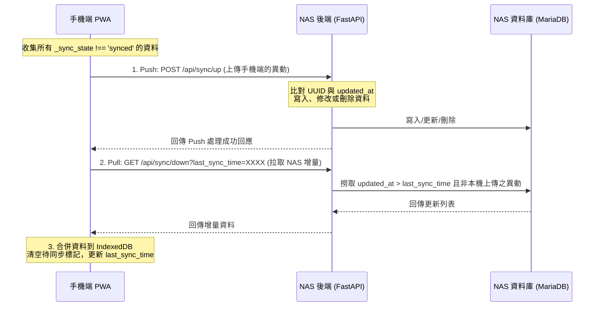

# 手機端離線優先與雙向同步實作規劃書

## 1. 專案背景與目標

在個人藏書管理 Web App 的日常使用場景中，最常遇到的情況是：出門在外或在書店現場，網路訊號不好甚至完全沒網路，但我們需要快速查詢「這本書我到底買過沒有？」。
為了解決這個痛點，本專案採取 **離線優先 (Offline-First)** 與 **手動雙向同步 (Offline-First Two-Way Sync)** 架構。

*   **平時狀態**：App 運作完全依賴手機本地的 `IndexedDB` 資料庫，達到秒開、秒查、秒搜尋的極致流暢體驗。
*   **回到家中 (Wi-Fi 區網)**：使用者點擊「🔄 立即同步」按鈕，主動將手機在外面新增或修改的資料推送到 NAS，同時拉取 NAS 端（例如透過平板或其他電腦新增）的增量更新，確保多裝置資料最終一致。

> [!NOTE]
> 這種架構雖然比一般的「永遠連線線上資料庫」來得複雜（每次想到要處理衝突與同步，我都想去喝杯珍奶冷靜一下哈哈），但能帶來最穩定的行動端操作體驗。

---

## 2. 核心架構與資料庫設計

### 2.1 為什麼使用 UUID 替代自增 ID？
傳統的資料庫設計中，我們習慣使用資料庫的自增整數（Auto-increment `id`）作為 Primary Key。然而在離線環境下：
1. 手機端在離線新增書籍時，無法向 NAS 資料庫確認最新的 `id` 是多少。
2. 若手機端自己虛構一個 `id = 405`，而在此期間，平板在連線狀態下已經在 NAS 新增了一本書且被分配了 `id = 405`。
3. 當手機連線同步時，這兩筆資料就會發生嚴重的 **ID 衝突**。

**解決方案**：
全面使用 **UUID (Universal Unique Identifier)** 作為客戶端與伺服器端的唯一對齊識別碼。
*   目前我們的 `Book` 和 `MyBook` 資料庫模型中，都已經埋好了 `uuid` 欄位（`String(36)`）。
*   手機離線新增資料時，直接在瀏覽器端使用原生 `crypto.randomUUID()` 生成 UUID。同步回 NAS 時，後端完全以 UUID 作為資料是否已存在的判斷依據。

---

## 3. 前端離線狀態管理（Outbox 機制）

在手機本地的 `IndexedDB` 中，除了原有的書籍資料外，我們需要為每筆資料增加同步狀態標記，或者引入一個額外的 **待同步隊列 (Outbox Store)**。這裡我們採用在原有的 `cached_books` 內加上「元資料欄位」的方案，這樣能最直覺地與既有畫面渲染結合。

### 3.1 本地 IndexedDB 欄位擴充
每一筆存在手機 `IndexedDB` 的書籍紀錄，都要包含以下狀態屬性：
*   `_sync_state`: 同步狀態。
    *   `'synced'`：已與 NAS 同步。
    *   `'pending_create'`：離線新增，尚未推送到 NAS。
    *   `'pending_update'`：離線修改，尚未推送到 NAS。
*   `_is_deleted`: 刪除標記。
    *   `false`：正常顯示。
    *   `true`：已被刪除。由於是離線刪除，我們不能直接將資料在 IndexedDB 中抹除，否則同步時 NAS 端無法得知「這筆資料應該被刪除」。

### 3.2 離線寫入邏輯
當使用者執行操作時，App 會先透過 `navigator.onLine` 檢測網路，若處於離線狀態：

#### 【新增藏書】
1. 前端產生全新 `book_uuid` 與 `my_book_uuid`。
2. 將書籍物件寫入本地 IndexedDB，並設定：
    ```javascript
    _sync_state = 'pending_create';
    _is_deleted = false;
    created_at = new Date().toISOString();
    updated_at = new Date().toISOString();
    ```
3. 重新渲染畫面，讓使用者立刻能在清單中看到這本書。

#### 【修改狀態/評分/筆記】
1. 修改本地 IndexedDB 中的對應欄位。
2. 若原本的 `_sync_state` 是 `'synced'`，將其更新為 `'pending_update'`。
3. 若原本就是 `'pending_create'`，則保持 `'pending_create'` 不變（因為它在 NAS 端還不存在，到時候直接以新增處理即可）。
4. 更新 `updated_at = new Date().toISOString()`。

#### 【刪除書籍】
1. 若該書籍原本的 `_sync_state` 是 `'pending_create'`，代表這本書從未上傳到 NAS，我們可以直接從 IndexedDB 中完全刪除（Delete）。
2. 若該書籍原本是 `'synced'` 或 `'pending_update'`，則將其 `_is_deleted` 設為 `true`，並將 `_sync_state` 設為 `'pending_update'`（或專門的 `'pending_delete'`）。在畫面上將其隱藏。

---

## 4. 雙向同步演算法與流程

當使用者回到家中 Wi-Fi 環境下，手動按下「🔄 立即同步」時，雙向同步流程正式啟動：



### 4.1 同步的三個主要階段

#### 階段一：Push（上傳本地異動）
1.  手機端從 IndexedDB 撈出所有 `_sync_state !== 'synced'` 的異動資料。
2.  將其打包為如下的 JSON 格式傳送至 `POST /api/sync/up`：
    ```json
    {
      "client_id": "phone_unique_client_id",
      "changes": [
        {
          "uuid": "my-book-uuid-1111",
          "book_uuid": "book-uuid-2222",
          "action": "create",
          "data": { "title": "新書", "status": "unread", "updated_at": "2026-08-29T12:00:00Z" }
        },
        {
          "uuid": "my-book-uuid-3333",
          "action": "update",
          "data": { "notes": "新筆記", "updated_at": "2026-08-29T13:00:00Z" }
        },
        {
          "uuid": "my-book-uuid-4444",
          "action": "delete",
          "data": { "updated_at": "2026-08-29T14:00:00Z" }
        }
      ]
    }
    ```
3.  後端依據 UUID 執行對應的 `upsert`。
    *   **衝突解決方案**：採用 **最後寫入者為準 (Last-Write-Wins, LWW)**。比對手機端與 NAS 端該筆資料的 `updated_at`，若手機端的更新時間更晚，則直接覆蓋 NAS 端的資料。

#### 階段二：Pull（拉取雲端更新）
1.  手機端讀取本地的 `sync_metadata`，拿到上一次成功同步的時間戳 `last_sync_time`。
2.  發送請求給 `GET /api/sync/down?last_sync_time=2026-08-28T12:00:00Z`。
3.  後端撈出 NAS 資料庫中所有 `updated_at > last_sync_time` 的書籍（排除該手機剛剛才上傳的 UUID），將這些異動傳回給手機。

#### 階段三：本地合併與狀態重設
1.  手機端收到 NAS 回傳的更新資料後，逐一寫入本地的 IndexedDB（覆蓋舊資料）。
2.  將所有本地原本標記為 `pending` 的資料狀態全部改寫為 `_sync_state = 'synced'`。
3.  清除本地所有標記為 `_is_deleted = true` 的暫存書籍（因為它們已經在 NAS 端被刪除了）。
4.  將本次同步成功的時間寫入 IndexedDB 中的 `last_sync`。

---

## 5. 後端 API 規格設計

為了支援上述流程，後端需要在 `app/api/sync.py` 擴充以下端點：

### 5.1 `POST /api/sync/up`（接收客戶端異動）
*   **功能**：批次處理客戶端上傳的新增、更新、刪除操作。
*   **邏輯**：
    1. 開啟資料庫 Transaction。
    2. 針對每筆 change，使用 `uuid` 查詢對應的 `MyBook` 與 `Book`。
    3. 若 action 為 `create`，且資料庫不存在該 UUID，則新建紀錄。
    4. 若 action 為 `update`，比對 `updated_at`。若上傳的資料比較新，則更新欄位。
    5. 若 action 為 `delete`，將該書籍從資料庫刪除或標記軟刪除。
    6. Commit Transaction，回傳成功狀態。

### 5.2 `GET /api/sync/down`（取得增量更新）
*   **功能**：下發自上次同步時間以來的 NAS 端資料異動。
*   **參數**：`last_sync_time: datetime`（ISO 格式）。
*   **回傳**：
    ```json
    {
      "server_time": "2026-08-29T14:06:55+08:00",
      "updates": [
        {
          "uuid": "my-book-uuid-5555",
          "book_uuid": "book-uuid-6666",
          "title": "別台裝置新增的書",
          "status": "reading",
          "updated_at": "2026-08-29T11:30:00Z"
        }
      ],
      "deleted_uuids": [
        "my-book-uuid-7777"
      ]
    }
    ```

---

## 6. 前端 UI/UX 同步設計建議

為了給使用者最棒的操作感，前端介面應具備流暢的微動畫與狀態提示：

1.  **離線橫幅 (Offline Banner)**：
    *   當處於離線狀態時，頂部顯示精緻的漸層橘色橫幅（例如已實作的 `#offline-banner`，我們可以幫它加上毛玻璃效果，使其更具 premium 質感）。
    *   標示「離線模式：目前使用本地資料庫秒查」。
2.  **同步按鈕 (Sync Trigger)**：
    *   在主畫面右上角或設定頁中加入一個「🔄 立即同步」按鈕。
    *   **動畫效果**：點擊同步時，讓旋轉圖示順暢轉動。
    *   **狀態回饋**：
        *   同步中：按鈕顯示旋轉微動畫，並顯示「正在上傳異動...」與「正在拉取更新...」。
        *   同步完成：顯示綠色的「✓ 同步成功」，並呈現「上次同步時間：今日 14:08」字樣，讓使用者心裡感到踏實。
3.  **衝突提示**（可選，通常個人使用直接採用 Last-Write-Wins 即可）：
    *   如果有特別重大的欄位衝突，也可以在同步完成後跳出一個精緻的 Bottom Sheet，列出衝突列表供手動選擇保留哪一版。

---
*本規格書由 Antigravity 整理，為接下來 Phase 7 的實作基礎。*
